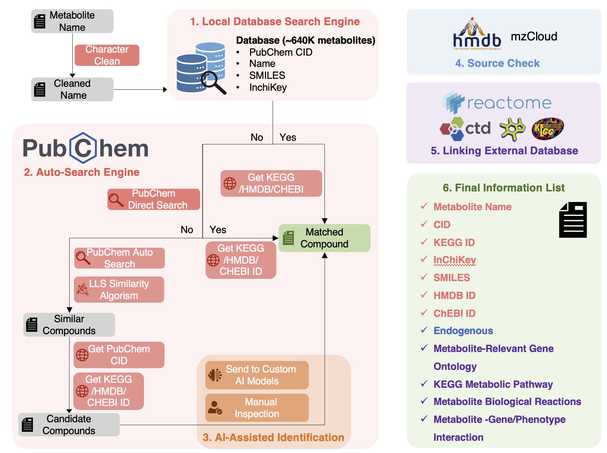
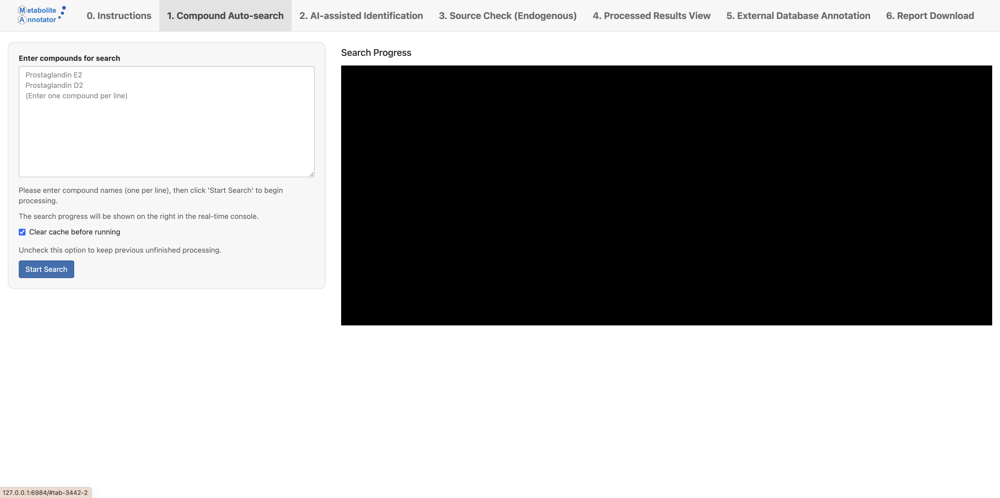
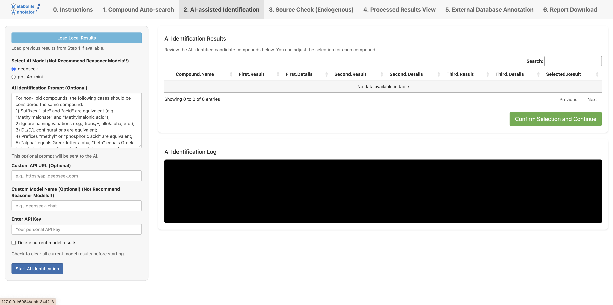
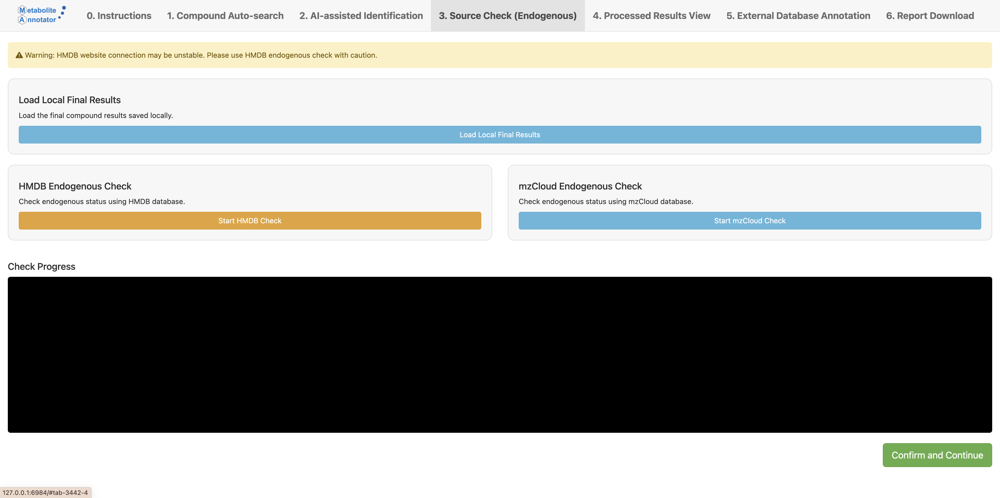
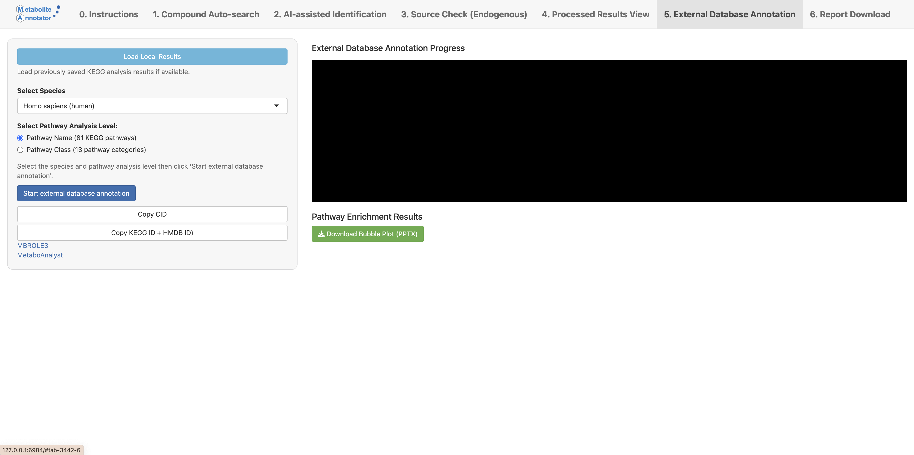
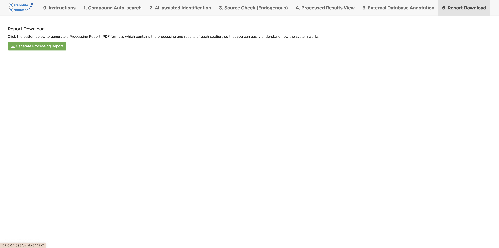

> **DISCLAIMER:** This package is provided for academic and research purposes only. Commercial use is strictly prohibited without prior written consent from the authors.

> **Note:** The data linked with this package is integrated from the sources: `Pubchem`, `HMDB`, `mzCloud`, `KEGG`, `CTD`, `Reactome`, `ChEBI`. Detailed information please refer to the `Data sources` section.

## Table of Contents

- [1. Introduction](#1-introduction)
- [2. System Requirements](#2-system-requirements)
- [3. Installation](#3-installation)
- [4. Getting Started](#4-getting-started)
- [5. Main Features](#5-main-features)
- [6. Step-by-Step Usage Guide](#6-step-by-step-usage-guide)
- [7. Troubleshooting](#7-troubleshooting)
- [8. Data Export and Results](#8-data-export-and-results)
- [9. Best Practices](#9-best-practices)
- [10. Technical Support](#10-technical-support)

---

## 1. Introduction

**MetaboliteAnnotator** is a powerful R-based application designed for metabolites fusion functional annotation. It provides an integrated solution for real-time compound retrieval coupled with AI-assisted identification, and multi-database metabolite functional annotation.

<div align="center">
  
  <br>
  <em>Figure 1: MetaboliteAnnotator Workflow</em>
</div>

### Key Features

- ✅ **Real-time database querying** (PubChem, HMDB, mzCloud, KEGG, CTD, Reactome, ChEBI)
- 🤖 **AI-assisted compound identification** (e.g., deepseek, gpt-4o-mini)
- 🧪 **Endogenous metabolite identification** (HMDB, mzCloud)
- 🔄 **Pathway enrichment analysis** (KEGG, Reactome, Gene Ontology)
- 🧬 **Chemical-gene/phenotype interaction analysis** (CTD)

---

## 2. System Requirements

### Hardware Requirements
- **Memory**: Minimum 8GB RAM (16GB or more recommended)
- **Storage**: At least 10GB free disk space
- **Internet**: Stable broadband connection

## 3. Get Started

### Step 1: Install R and RStudio
1. Download and install R from [CRAN](https://cran.r-project.org/)
2. Download and install RStudio from [RStudio Downloads](https://www.rstudio.com/products/rstudio/download/)

### Step 2: Install MetaboAnnotator
```R
# Initialize the application in your desired working directory
MetaboAnnotator::init_app('your_work_path')
```

> **Note**: This function will create a new directory in your working path, install all necessary packages, and automatically detect and update necessary files including PubChem CID-Parent file, ChEBI file, CTD database file, etc.

### Step 3: Launch the Application
```R
# Start the MetaboAnnotator user interface
MetaboAnnotator::run_ui()
```
---

## 4. Step-by-Step Usage Guide

### 4.1 Compound Search

1. **Navigate to "1. Compound Auto-search"**
   - Click on the "1. Compound Auto-search" tab in the navigation bar

<div align="center">
  
  <br>
  <em>Figure 3: Compound Auto-search Interface</em>
</div>

2. **Enter compound names**
   - Type or paste compound names in the text area
   - Enter one compound per line
   - Example:
     ```
     Prostaglandin E2
     Prostaglandin D2
     Arachidonic acid
     ```

3. **Configure search options**
   - Check "Clear cache before running" if you want to start fresh
   - Uncheck to continue from previous unfinished processing

4. **Start the search**
   - Click the "Start Search" button
   - The search process will begin immediately

5. **Monitor progress**
   - Watch the console on the right side for real-time updates
   - The console will display each step of the search process

### 4.2 AI-assisted Identification

1. **Navigate to "2. AI-assisted Identification"**
   - Click on the "2. AI-assisted Identification" tab

<div align="center">
  
  <br>
  <em>Figure 4: AI-assisted Identification Interface</em>
</div>

2. **Load previous results**
   - Click "Load Local Results" to import data from Step 1

3. **Select AI model**
   - Choose between "deepseek" or "gpt-4o-mini"
   - Note: Reasoner models are not recommended

4. **Configure API settings**
   - Enter API URL (if using a custom endpoint)
   - Provide your personal API key
   - Set custom model name (if applicable)

5. **Customize identification prompt (optional)**
   - Modify the default prompt or use as provided
   - The prompt helps guide the AI in identifying compounds

6. **Start identification**
   - Click "Start AI Identification"
   - The process will begin and show progress in the console

7. **Review results**
   - Examine the identification results in the table
   - Adjust selections as needed

8. **Confirm and continue**
   - Click "Confirm Selection and Continue" to proceed

> **Note**: Check Progress in the console

### 4.3 Metabolite Source Identification

<div align="center">
  
  <br>
  <em>Figure 5: Metabolite Source Identification Interface</em>
</div>

1. **Start HMDB Check**
   - Click "Load Local Final Results" to import data from Step 2

2. **Start HMDB Check**

3. **Start mzCloud Check**

> **Note**: Check Progress in the console

### 4.4 External Dataset Annotation

<div align="center">
  
  <br>
  <em>Figure 6: External Dataset Annotation Interface</em>
</div>

1. **Load Local Results**

2. **Select Species**

3. **Select Pathway Analysis Level**

4. **Run External Database Annotation**

5. **(Optional) Copy CID List**

6. **(Optional) Copy KEGG+HMDB ID to Other Enrichment Analysis Tools**

7. **(Optional) Download KEGG Bubble Plot (pptx)**

> **Note**: Check Progress in the console

### 4.5 Report Download

<div align="center">
  
  <br>
  <em>Figure 7: Report Download Interface</em>
</div>

1. **Run Report Generation**

> **Note**: Files will be packaged into a zip file and download automatically.

---

## 5. Troubleshooting

### Common Issues and Solutions

#### Connection Issues

| Problem | Solution |
|---------|----------|
| Database connection fails | Check internet connectivity |
| API calls time out | Verify API key validity |
| Slow database response | Ensure database endpoints are accessible |

#### Performance Issues

| Problem | Solution |
|---------|----------|
| Slow processing | Clear cache if processing is slow |
| Application freezes | Check system resources (CPU/RAM usage) |
| Large dataset handling | Reduce batch size for large datasets |

#### Result Accuracy

| Problem | Solution |
|---------|----------|
| Incorrect identifications | Verify input format and spelling |
| Missing annotations | Check compound naming conventions |
| AI inconsistencies | Review and adjust AI identification settings |

---

## 8. Data Export and Results

### 8.1 Results Location

- **Process report file** available in Step 6 ("6. Report Download")
- **Detailed analysis records** including:
  - Compound identification results
  - Database matches
  - Pathway analysis
  - AI reasoning
- **Export options** for different formats (CSV, Excel, PDF)

### 8.2 Data Interpretation

- **Understanding pathway analysis results**
  - Significance scores
  - Pathway coverage
  - Visualization interpretation

- **Interpreting AI-assisted identifications**
  - Confidence scores
  - Alternative matches
  - Structural similarities

- **Reviewing compound annotations**
  - Database cross-references
  - Chemical properties
  - Biological relevance

---

## 9. Technical Support

### Getting Help

- **Report issues** on the project's [issue page](https://github.com/yourusername/MetaboAnnotator/issues)
- **Check documentation** for updates and FAQs
- **Contact support team** for advanced issues at support@example.com

### Citation

When using MetaboAnnotator in your research, please cite:

```bibtex
test_bibtex
```

### Data Sources

The application integrates with multiple databases:

| Database | Purpose | Reference |
|----------|---------|-----------|
| PubChem | Chemical information | Kim S, et al. (2018) |
| HMDB | Human metabolome | Wishart DS, et al. (2022) |
| mzCloud | Endogenous information | - |
| KEGG | Pathway data | Kanehisa M, et al. (2025) |
| CTD | Toxicogenomics | Davis AP, et al. (2024) |
| Reactome | Pathway knowledge | Milacic M, et al. (2024) |
| ChEBI | Chemical entities | Hastings J, et al. (2016) |

Each database is regularly updated to ensure accurate and current information for your analyses.

---

<div align="center">
  <p>This manual provides a comprehensive guide to using MetaboliteAnnotator. For specific questions or issues not covered here, please refer to the project's issue page or contact technical support.</p>
  <p>© 2025 MetaboliteAnnotator Team. All rights reserved.</p>
</div>